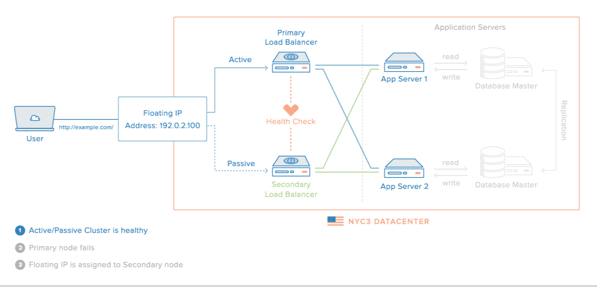

# [Nginx Proxy](https://github.com/jwilder/nginx-proxy)<sup>－基于 Docker 的自动化网关</sup>

> 当前版本为 **v0.7.0**，源镜像最新版本 [](https://github.com/jwilder/nginx-proxy)


<sub>Image by [Mateusz Tarnawa's Blog](https://mtarnawa.org/2017/11/10/running-secured-private-docker-registry-nginx-proxy-letsencrypt/)</sub>


<sub>Image by [Justin Ellingwood](https://www.digitalocean.com/community/users/jellingwood) via [DigitalOcean Community](https://www.digitalocean.com/community/tutorials/understanding-nginx-http-proxying-load-balancing-buffering-and-caching)</sub>

## Getting Started

### Basics

#### Step 1: Run containers

See [`docker-compose.internal.yml`](https://raw.githubusercontent.com/y0ngb1n/dockerized/master/nginx-proxy/docker-compose.internal.yml) for details.

```bash
mkdir -p /usr/local/docker/nginx-proxy ; cd $_
curl -sSL https://raw.githubusercontent.com/y0ngb1n/dockerized/master/nginx-proxy/docker-compose.internal.yml > docker-compose.internal.yml
docker-compose -f docker-compose.internal.yml up -d
```

#### Step 2: Try to access

 You can easily be accessed your application containers.

```console
$ curl -H "Host: whoami.local" localhost
I'm 0714faf158a5
```

#### Step 3: Stop and remove the currently running container

```bash
docker-compose -f docker-compose.internal.yml down
```

### Using the Multiple Networks

#### Step 1: Create a network

See [multiple networks](https://github.com/jwilder/nginx-proxy#multiple-networks) for details.

```bash
docker network create nginx-proxy
```

#### Step 2: Launch containers within your network

Run your **nginx-proxy** container to be attached to `nginx-proxy` network, see [`docker-compose.yml`](https://raw.githubusercontent.com/y0ngb1n/dockerized/master/nginx-proxy/docker-compose.yml) for details.

```bash
mkdir -p /usr/local/docker/nginx-proxy ; cd $_
curl -sSL https://raw.githubusercontent.com/y0ngb1n/dockerized/master/nginx-proxy/docker-compose.yml > docker-compose.yml
docker-compose up -d
```

Run other containers to be attached to `nginx-proxy` network, see [`docker-compose.external.yml`](https://raw.githubusercontent.com/y0ngb1n/dockerized/master/nginx-proxy/docker-compose.external.yml) for details.

```bash
curl -sSL https://raw.githubusercontent.com/y0ngb1n/dockerized/master/nginx-proxy/docker-compose.external.yml > docker-compose.external.yml
docker-compose -f docker-compose.external.yml up -d
```

#### Step 3: Try to access

 You can easily be accessed your application containers using the command.

```console
$ curl -H "Host: whoami.local" localhost
I'm 0350fcfa4caf
```

#### Step 4: Stop and remove the currently running container

```bash
docker-compose down
docker-compose -f docker-compose.external.yml down
```

---

解锁更多姿势请参考：

- [官方文档](https://github.com/jwilder/nginx-proxy)

## 其它选择

- [使用服务发现改善开发体验](https://soulteary.com/2018/06/11/use-server-side-discovery-improve-development.html), by 苏洋 —— 介绍了如何将 [Traefik](https://traefik.io/) 作为服务网关

## 相关资源

- [nginx-quick-reference](https://github.com/trimstray/nginx-quick-reference)
- [nginxconfig.io](https://nginxconfig.io/)
- [letsencrypt-nginx-proxy-companion](https://github.com/JrCs/docker-letsencrypt-nginx-proxy-companion)
- [mkcert](https://mkcert.dev/)

## 参考链接

+ https://segmentfault.com/a/1190000015385945
