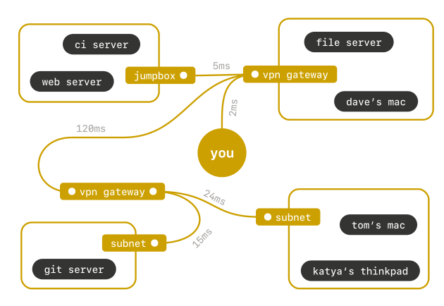

# [Tailscale](https://tailscale.com/) - 搭建属于自己的虚拟局域网 

<p align="center">
    
</p>

---

## TL;DR;

The quickest way to get started is using [docker-compose](https://docs.docker.com/compose/).

```bash
mkdir -p /usr/local/dockerized/tailscale ; cd $_
git svn clone https://github.com/y0ngb1n/dockerized/trunk/tailscale .
docker-compose up -d
```

## 🛰 组网对比

| 🌐 加入网络前                                          | 🛰 加入网络后                                         |
|--------------------------------------------------------|------------------------------------------------------|
|  |  |


## 🚀 使用方式 [](https://hub.docker.com/r/y0ngb1n/tailscale)

### 使用 Docker Compose 部署

```yaml
version: '3.3'

services:
  tailscale:
    image: "y0ngb1n/tailscale:latest"
    container_name: "tailscale"
    restart: "unless-stopped"
    privileged: true
    network_mode: "host"
    hostname: "homelab"
    cap_add:
      - NET_ADMIN
      - SYS_ADMIN
    volumes:
      - "/dev/net/tun:/dev/net/tun"
      - "/var/lib/tailscale:/var/lib/tailscale"
    logging:
      driver: "json-file"
      options:
        max-size: "1m"
```

1️⃣ 启动 `tailscale` 服务

```console
$ docker-compose up -d
```

2️⃣ 授权，须将下面提示的链接粘贴到浏览器中进行登录授权

```console
$ docker exec -it tailscale tailscale up

To authenticate, visit:

        https://login.tailscale.com/a/u50138fcc586

Success. # 组网成功
```

3️⃣ 打开 [Tailscale 的管理台](https://login.tailscale.com/admin/machines) 查看组网明细

## 💗️ 感谢开源

- [jzelinskie/tailscale](https://quay.io/repository/jzelinskie/tailscale)

## 🎮 同类产品

+ [ZeroTier](../zerotier/)

## 🔗️ 参考链接

- https://tailscale.com/download
- https://pkgs.tailscale.com/stable/
